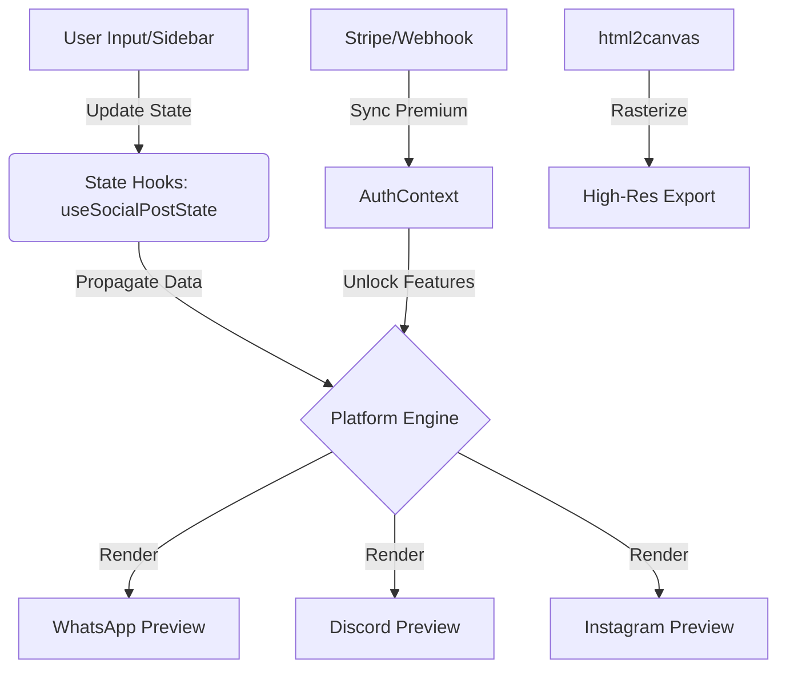

# VEILY — The Ultimate Social Media Architecture for Designers & Creators


## 🚀 Overview

**VEILY** is a state-of-the-art, high-fidelity mock-up engine and preview environment designed to bridge the gap between concept and reality. In an age where digital presence is everything, VEILY provides a sandbox for designers, social media managers, and developers to visualize, iterate, and export pixel-perfect representations of social digital life.

Unlike generic design tools, VEILY is built with **platform-native logic**. It doesn't just look like the platforms it mimics; it understands their structure—from the specific font-weight of a Discord message to the exact nesting depth of a TikTok comment thread.

---

## ✨ Core Features & Platform Capabilities

### 1. Unified Chat Mock-up Suite
The crown jewel of VEILY is its universal chat generator. It supports over **15+ global messaging platforms**, each rendered with absolute precision.
- **Messaging Giants**: WhatsApp, iMessage, Messenger, WeChat, LINE, and Telegram.
- **Community Platforms**: Discord, Slack, and Teams.
- **Social & Niche**: Instagram DM, Snapchat, Reddit, Signal, and even Tinder.
- **Deep Customization**: 
    - Full **Dark Mode/Light Mode** support with native color palettes.
    - **Device Simulations**: Toggle high-fidelity iPhone frames, status bars (with custom time, battery, and signal), and notch designs.
    - **Participant Control**: Managing "SENDER" and "RECEIVER" accounts with custom avatars, online statuses, and verified badges.

### 2. AI Interaction Layer
Designed for the modern tech landscape, VEILY allows you to simulate high-level interactions with major AI assistants.
- **Supported Models**: ChatGPT (OpenAI), Claude (Anthropic), Gemini (Google), and Grok (xAI).
- **Behavioral UI**: Each AI platform includes its distinct response animations, button layouts, and typography.

### 3. Social Media Post Composer
Visualize how your content will perform across the "Big Four" social networks.
- **X (Twitter)**: Handle retweets, likes, and view counts with native formatting.
- **Facebook & Instagram**: High-fidelity feed post simulation.
- **LinkedIn**: Professional layout for corporate branding previews.
- **Dynamic Metrics**: Real-time counters that allow you to "see" your viral potential.

### 4. Advanced Comments & Threading
The most complex part of social media is the conversation. VEILY handles this with ease.
- **Multi-Level Nesting**: True hierarchical threading for YouTube and Reddit-style discussions.
- **Engagement Hooks**: Individual engagement controls for every single comment in the thread.
- **Rich Media Support**: Simulation of attached images and profile iconography within lists.

---

## 🎯 Strategic Use Cases

VEILY isn't just a tool; it's a productivity multiplier for diverse professional workflows:

- **Marketing Agencies**: Presenting social media strategies to clients using realistic previews instead of boring spreadsheets.
- **UX/UI Designers**: Rapidly prototyping messaging features without leaving the browser.
- **Content Creators**: Planning aesthetic "fake chat" stories or viral post designs for Instagram/TikTok.
- **Legal & Compliance**: Creating clear-cut visual representations of digital communications for documentation purposes.
- **App Developers**: Visualizing how their third-party integrations (like Discord bots or Slack apps) will appear in-situ.

---

## 🛠️ The Technology Behind the Magic

VEILY is built on a modern, ultra-fast stack for maximum performance and reliability:

- **React 18 & Vite**: Core SPA engine for sub-second reload times.
- **TypeScript**: Enterprise-grade type safety across complex platform data structures.
- **Supabase**: Powering real-time Authentication and user state management.
- **Stripe**: Seamless payment infrastructure for premium upgrades.
- **Tailwind CSS & Shadcn UI**: Custom design system for rapid, accessible UI development.
- **html2canvas**: Robust engine for high-DPI DOM-to-PNG exports.

---

## 🛠️ How it Works: The Architecture

VEILY operates as a purely state-driven preview engine. Every change you make in the sidebar controls updates a local state hook (e.g., `useSocialPostState`), which then propagates down to the platform-specific components for real-time rendering.



### Isolated Scrolling System
The app features a custom-built **Isolated Scrolling & Relative Centering** system:
1. **Static Previews**: The preview area is fixed, meaning while you scroll through 50+ editing controls in the sidebar, your "canvas" never moves.
2. **Mathematical Centering**: Using advanced CSS Flex-logic and dynamic offsets (`lg:pl-[450px]`), the preview and global navigation are perfectly centered relative to the *visible workspace*.
3. **Chromatic Branding**: Features a custom-rendered "Fancy Logo" with RGB-split effects.

---

## 📦 Project Directory Breakdown

```text
root/
├── api/               # Vercel Serverless Functions (Stripe Webhooks & Checkout)
├── src/
│   ├── components/
│   │   ├── platforms/     # Dynamic platform-specific rendering logic
│   │   ├── sidebar/       # Contextual controls for AI and Appearance
│   │   ├── modals/        # Global Auth and Subscription flow overlays
│   │   ├── social/        # Detailed social media card components
│   │   └── ui/            # Atomic Radix-based components (Buttons, Inputs, etc.)
│   ├── contexts/          # Global state management (Auth, Premium Status)
│   ├── hooks/             # Feature logic (Screenshot engine, social/chat state)
│   ├── pages/             # Core application views (AIChat, SocialPost, etc.)
│   ├── integrations/      # Third-party configurations (Supabase API Client)
│   └── lib/               # Utility functions, tailwind mergers, and shared instances
├── supabase/              # Supabase CLI and database configuration files
├── public/                # Static assets, fonts, and brand resources
├── tailwind.config.ts     # The color, spacing, and platform-specific DNA of the app
└── vite.config.ts         # Build tool configuration and path aliasing
```

---

## 🛠️ Getting Started

### Environment Setup
Create a `.env` file in the root directory with the following keys:
- `VITE_SUPABASE_URL` / `VITE_SUPABASE_PUBLISHABLE_KEY`
- `SUPABASE_SECRET_KEY` (Service Role)
- `STRIPE_SECRET_KEY` / `VITE_STRIPE_PUBLISHABLE_KEY`
- `STRIPE_WEBHOOK_SECRET`

### Development
```bash
npm install
npm run dev
```

## � Roadmap & Vision

VEILY is continuously evolving. Our goal is to become the **industry standard** for digital world-building. Future updates include:
- 📹 **Video/GIF Export**: Moving beyond static screenshots to animated previews.
- 📂 **Project Saving**: Cloud-based storage for recurring mock-up templates.
- 🎨 **Theme Engine**: Allowing users to create "Custom Platforms" with their own CSS variables.

---

## 🛡️ License & Credits

Built with ❤️ by the **Veil**.

This project is licensed under the **MIT License**. See the [LICENSE](file:///f:/AI/Veily/LICENSE) file for more details.
