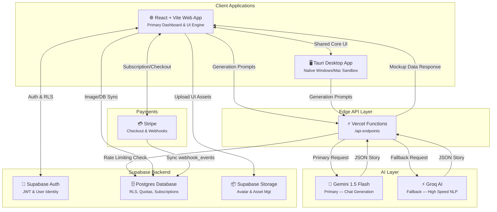
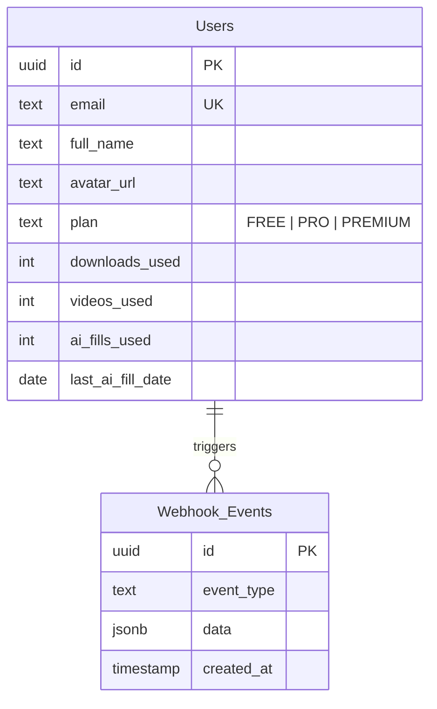

<div align="center">

# 🌕 Veily

### High-Fidelity Social Media Design & AI Preview Engine

A professional-grade pixel-perfect sandbox to visualize, generate, and export digital life representations across 20+ global platforms.

[](https://veily.venusapp.in/)
[](#)


</div>

---

## 📖 Summary

**Veily** is a professional-grade mock-up and preview engine designed for marketers, designers, and developers. It provides a pixel-perfect sandbox to visualize representations of digital life across 20+ global platforms (WhatsApp, iMessage, Twitter, Instagram, etc.). Available as both a high-performance **Web Application** and a native **Tauri Desktop Application**.

Unlike generic design tools, Veily is built with **platform-native UI logic**, ensuring that every font-weight, padding, and interactive element perfectly matches official specifications. It features an integrated **AI Smart Fill** engine that instantly generates realistic mock conversations and social posts using Google's generative models.

Backed by **Supabase** for robust authentication, data persistence, and protected **Stripe** payment tiers.

---

## ✨ Features

### 💬 Core Engine Platforms
| Feature | Description |
|---|---|
| **Chat Preview Engine** | Pixel-perfect messaging UI for WhatsApp, iMessage, Messenger, Telegram, Discord, and more. |
| **Social & Stories** | Feed & full-screen story mockups for Twitter, Instagram, Snapchat, Facebook, and LinkedIn. |
| **Email Previews** | Clean, professional UI rendering for Gmail, Outlook, and generic corporate designs. |
| **Interactive Elements** | Real-time verified badges, "read" receipts, active typing indicators, and avatars. |

### 🤖 AI Pipeline
| Feature | Description |
|---|---|
| **AI Smart Fill** | Describe a scenario ("A funny argument about pizza") to instantly generate complete chat histories. |
| **Custom AI States** | Support for mocking AI bots (ChatGPT, Claude, Gemini, Grok) with custom headers & behaviors. |
| **Dual Provider Fallback** | Gemini 1.5 Flash (primary generation) → Groq + Llama 3 (fallback pipeline). |
| **Plan-Gated Usage** | Secure serverless API routes strictly rate-limiting AI generation per user subscription tier. |

### 🔐 Platform Capabilities
| Feature | Description |
|---|---|
| **Cross-Platform** | Fully responsive Web App + Native Windows/macOS Desktop Executables (Tauri). |
| **Bulk Import Parser** | (Premium) One-click data ingestion of raw WhatsApp (`.txt`) and Telegram (`.json`) logs. |
| **Supabase RLS Auth** | Secure state management, row-level protected usage quotas, limiting storage abuse. |
| **Optimized Exports** | Advanced edge-to-edge `html2canvas` pipeline to produce crisp, high-DPI image assets. |

---

## 🏗 Architecture



---

## 🛠 Tech Stack

| Layer | Technology | Purpose |
|---|---|---|
| **Frontend UI** | React 18, Vite | High-performance SPA & build tooling |
| **Styling** | TailwindCSS, ShadCN UI | Strict utility design tokens & accessible primitives |
| **Desktop Core** | Tauri (Rust) / Electron | Native OS bundling & filesystem access |
| **Backend/Auth** | Supabase Postgres | Authentication, Row Level Security, Webhooks |
| **AI (Primary)** | Google Gemini 1.5 Flash | Instant text/chat scenario generation |
| **AI (Fallback)** | Groq (Llama) | Redundant high-speed inference pipeline |
| **API Endpoints** | Vercel Serverless Functions | Edge-hosted AI handlers & rate limiting |
| **Payments** | Stripe | Tiered subscription tracking & checkout |
| **Export/Render** | `html2canvas` | Real-time DOM-to-image conversion for high-DPI assets |

---

## 📂 Project Structure

```text
Veily/
│
├── src/                                # ─── React/Vite Client Application ───
│   ├── assets/                         # Static icons, vector shapes, global fonts
│   ├── components/                     # UI Components
│   │   ├── modals/                     # Accessible dialogs (AuthModal, SmartFillModal, etc.)
│   │   └── ui/                         # Base ShadCN primitives (button, input, select)
│   ├── contexts/                       # Application State (AuthContext, ThemeContext)
│   ├── hooks/                          # Custom React Hooks
│   ├── integrations/                   # Supabase query wrappers & mutations
│   ├── lib/                            # Shared Utilities
│   │   ├── supabase.ts                 # Supabase client instantiation
│   │   ├── utils.ts                    # Class merging, formatting
│   │   └── electron-utils.ts           # Desktop IPC fallback logic
│   ├── pages/                          # Main Application Views (Auth, Index, Chat, Social)
│   ├── types/                          # Global TypeScript Definitions
│   ├── App.tsx                         # Core Router and Providers
│   └── index.css                       # Global Tailwind definitions & design variables
│
├── src-tauri/                          # ─── Tauri Rust Backend ───
│   ├── src/                            # Rust IPC Handlers
│   ├── Cargo.toml                      # Rust dependencies and app configuration
│   └── tauri.conf.json                 # Tauri build identifiers and native settings
│
├── api/                                # ─── Vercel Serverless Functions ───
│   └── (AI Endpoints, Webhooks)
│
├── public/                             # Public static assets & index.html entry
│
├── FullDatabaseSchema.sql              # Supabase Postgres schema & RLS rules
├── package.json                        # Frontend NPM scripts & dependencies
├── vite.config.ts                      # Vite build configuration
├── tailwind.config.ts                  # Tailwind theme, sizes, animations
└── .env                                # Environment variable definitions
```

---

## 🗄️ Database Schema

### Core Tables



### Security & Triggers
- **Row Level Security (RLS)**: Users can strict-select and update only their specific ID token records.
- **Service Hooks**: The Stripe endpoint routes insert to `webhook_events`, bypassing standard RLS purely under `service_role` execution.
- **Atomic AI Tracking**: A PostgreSQL RPC Function (`increment_ai_fills`) governs transactional daily limits to prevent race conditions during rapid API generation blocks.

---

## 💰 Subscription Plans

| Application Limits | FREE | PREMIUM |
|---|:---:|:---:|
| **Platform Mockups** | Chat + Social Core | ALL (Email, Dating, Custom) |
| **High DPI Export** | Watermarked | 4K Unfettered |
| **Daily Smart Fill** | 5 AI generations | Unlimited AI Generations |
| **Bulk Import Parser** | ❌ | WhatsApp & Telegram logs |
| **Support SLA** | Community | Priority Inbox |

---

## 🚀 Getting Started

### 1. Prerequisites
- Node.js 18+
- Active Supabase Project
- Stripe Developer Keys
- API Keys for Google Gemini & Groq

### 2. Setup
Clone the repo and configure your `.env` variables at the project root:

```env
VITE_SUPABASE_URL=your_supabase_url
VITE_SUPABASE_ANON_KEY=your_supabase_anon_key
VITE_STRIPE_PUBLISHABLE_KEY=your_stripe_key
STRIPE_SECRET_KEY=your_stripe_secret
GEMINI_API_KEY=your_gemini_key
GROQ_API_KEY=your_groq_key
```

### 3. Initialize Database
Execute `DB.sql` entirely in your Supabase SQL Editor. This will orchestrate table structures, default RLS policies, bucket allocations for User Avatars, and the daily AI usage limit RPC function.

### 4. Build & Run Environment

```bash
# 1. Install all dependencies
npm install

# 2. Run Local Web Dev Server + Vercel Functions
npx vercel dev

# 3. Compile Desktop native application (Tauri)
npm run tauri:dev
```

---

## 📝 License

[](./LICENSE)

This project is licensed under the **MIT License** — see the [LICENSE](./LICENSE) file for complete restrictions and authorizations.
