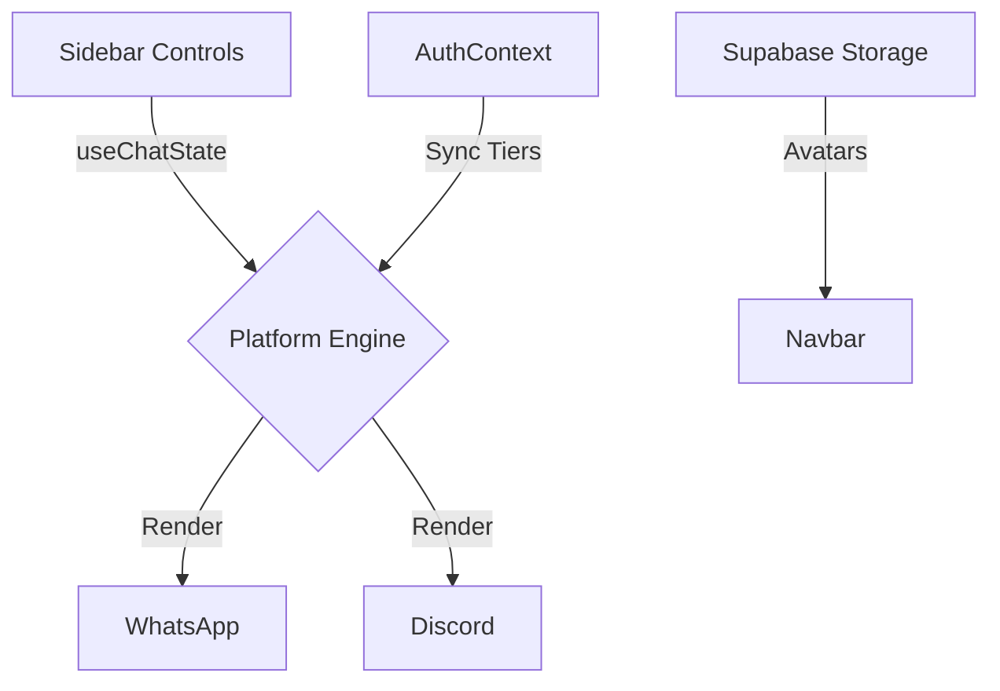

# VEILY — High-Fidelity Social Media Design & Preview Engine


[**Live Demo →**](https://veily.venusapp.in/)

## 🚀 Overview

**VEILY** is a state-of-the-art mock-up engine designed for designers, social media managers, and developers. It provides a pixel-perfect sandbox to visualize and export representations of digital life across 15+ global platforms. Now available as both a high-performance **Web App** and a native **Desktop Application**.

Unlike generic design tools, VEILY is built with **platform-native logic**, understanding the specific nuances of each platform—from font-weights to nesting depths.

---

## ✨ Core Features

### 1. Unified Chat Mock-up Suite
Over **15+ messaging platforms** rendered with absolute precision:
- **Messaging**: WhatsApp, iMessage, Messenger, Telegram, Signal.
- **Community**: Discord, Slack, Teams.
- **Social**: Instagram DM, Snapchat, Reddit, Tinder.
- **AI**: ChatGPT, Claude, Gemini, Grok.

### 2. SaaS Infrastructure & Profile
- **Subscription Engine**: Integrated with Stripe for tiered access (Free, Pro, Premium).
- **Usage Tracking**: Real-time synchronization of download and video export limits.
- **Profile Management**: Secure, storage-backed avatar uploads with strict RLS policies.

### 3. 🖥️ Native Desktop Experience
- **Electron Powered**: Faster asset delivery and native Windows integration.
- **Standalone EXE**: Professional installer for a streamlined creator workflow.

---

## 🛠️ The Tech Stack

- **Frontend**: React 18, Vite, Tailwind CSS, Shadcn UI.
- **Backend / SaaS**: Supabase (Auth, DB, Storage), Stripe Payments.
- **Desktop**: Electron, Electron-Builder.
- **Export**: html2canvas for high-DPI image generation.

---

## 📦 Getting Started

### Environment Setup
Create a `.env` file with the following:
- `VITE_SUPABASE_URL` / `VITE_SUPABASE_PUBLISHABLE_KEY`
- `STRIPE_SECRET_KEY` / `VITE_STRIPE_PUBLISHABLE_KEY`
- `STRIPE_WEBHOOK_SECRET`

### Development
```bash
# Install dependencies
npm install

# Run Web App
npm run dev

# Run Desktop App
npm run electron

# Build Windows Installer (.exe)
npm run dist
```

---

## 🏗️ Architecture: The Preview Engine

VEILY operates as a purely state-driven preview engine. Every change in the sidebar propagates through custom React hooks to platform-specific components for real-time, low-latency rendering.



### Isolated Scrolling & Centering
Features a custom-built UX system where the editing sidebar scrolls independently while the preview "canvas" remains mathematically centered relative to the visible workspace.

---

## 🛡️ License & Credits

Built with ❤️ by **Veil**.
This project is licensed under the **MIT License**.
