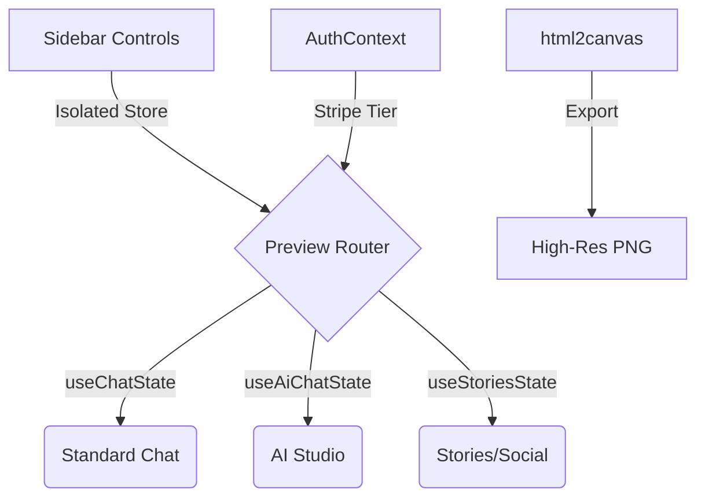

# VEILY — High-Fidelity Social Media Design & Preview Engine


[**Live Demo →**](https://veily.venusapp.in/)

## 🚀 Overview

**VEILY** is a professional-grade mock-up engine designed for marketers, designers, and developers. It provides a pixel-perfect sandbox to visualize and export representations of digital life across 20+ global platforms. Available as both a high-performance **Web App** and a native **Desktop Application**.

Unlike generic design tools, VEILY is built with **platform-native logic**, ensuring that every font-weight, padding, and UI element matches official specifications.

---

## ✨ Core Modules

### 1. 💬 Chat Preview Engine
Render messaging conversations with absolute precision across 15+ platforms:
- **Major Apps**: WhatsApp, iMessage, Messenger, Telegram, Signal, Line.
- **Communities**: Discord, Slack, Microsoft Teams.
- **Social DMs**: Instagram, Snapchat, Reddit, X (Twitter), TikTok.
- **Dating**: Tinder.

### 2. 🤖 AI Chat Studio (New!)
A dedicated suite for creating AI-centric mockups:
- **Supported Models**: ChatGPT (OpenAI), Claude (Anthropic), Gemini (Google), Grok (xAI).
- **Customizable Logic**: Adjust model names, "typing" states, and unique AI response headers.

### 3. 📸 Social & Stories
Complete control over feed and story layouts:
- **Social Posts**: High-fidelity previews for Twitter, Instagram, Facebook, LinkedIn, and Reddit.
- **Stories Engine**: Full-screen story previews for Instagram, Snapchat, WhatsApp, and Facebook (Messenger).
- **Interactive Elements**: Real-time verified badges, "seen" receipts, and interactive avatars.

### 4. 📧 Email Mockups
Generate clean, professional email previews for:
- **Gmail**: Pixel-perfect material design layout.
- **Outlook**: Corporate-grade modern layout.
- **Generic (Legal/Classic)**: Serif-based, redaction-heavy layout for official documentation.

### 📂 Bulk Import Engine (Premium)
Accelerate your workflow with one-click data ingestion:
- **Smart Parsers**: Automatically extract history from WhatsApp (`.txt`) and Telegram (`.json`) exports.
- **Identity Mapping**: Intelligently maps participant names to visual avatars and IDs.
- **One-Click Render**: Instantly transform years of raw chat logs into high-fidelity visual mockups.

---

## 🛠️ The Tech Stack

- **Frontend**: React 18 (Hooks, Context API), Vite, Tailwind CSS, Shadcn UI.
- **Backend / SaaS**: Supabase (Auth, Postgres DB, Edge Functions, Storage).
- **Payments**: Stripe API for tiered subscriptions and credit management.
- **Desktop**: Electron with `electron-builder` for multi-platform distribution.
- **Export Engine**: Optimized `html2canvas` pipeline for high-DPI image generation.

---

## 🏗️ Technical Architecture

VEILY uses an **Atomic State** architecture where UI configurations are isolated from the rendering engine.



### Key Architectural Features:
- **Independent State Isolation**: Switching between Chat and AI Chat preserves independent histories and settings using segregated storage keys.
- **Theme-Aware Watermarks**: Dynamic SVG watermarking that automatically adjusts contrast (White/Ash) based on dark/light mode detection.
- **Secure Admin Core**: A hardened administrative "backdoor" protected by SHA-256 hashing, granting full premium access for testing without needing Stripe transactions.

---

## 📦 Getting Started

### Prerequisites
- Node.js 18+
- Supabase account & project
- Stripe developer account

### Setup
1. **Clone the Repo**
2. **Configure Environment**
   Create a `.env` file:
   ```env
   VITE_SUPABASE_URL=your_url
   VITE_SUPABASE_PUBLISHABLE_KEY=your_key
   VITE_STRIPE_PUBLISHABLE_KEY=your_key
   STRIPE_SECRET_KEY=your_key
   ```
3. **Install & Run**
   ```bash
   npm install      # Install dependencies
   npm run dev      # Start Web Development
   npm run electron # Start Desktop App
   npm run dist     # Build for Windows (.exe)
   ```

## 💎 Subscription & Tiered Features

VEILY uses a tiered access model to balance platform accessibility with premium features.

| Feature | Free | Pro | Premium |
| :--- | :---: | :---: | :---: |
| **Standard Platforms (15+)** | ✅ | ✅ | ✅ |
| **Stories & Social Feed** | ❌ (View Only) | ✅ | ✅ |
| **AI Chat & Email Studio** | ❌ | ✅ | ✅ |
| **Watermark Removal** | ❌ | ✅ | ✅ |
| **Daily Export Limit** | 3 | 20 | Unlimited |
| **Video Export** | ❌ | 5/mo | Unlimited |
| **Bulk Import (.txt/.json)** | ❌ | ❌ | ✅ |
| **Priority Support** | ❌ | ❌ | ✅ |

---

## 🚀 Future Roadmap: The Vision for VEILY

### 🎥 Motion & Video Studio
- **Typing Animations**: Export "Live" mockups showing the typing bubbles appearing in sequence.
- **Scroll Captures**: Record vertical scrolling interactions for long-form conversations.

### 🤖 AI Conversation Generator
- **Smart Fill**: Describe a scenario (e.g., "A funny argument about pizza") and have LLM technology instantly generate the entire message history for you.

---

## 🛡️ License & Credits

Built for the next generation of digital creators by **Veil**.
Licensed under the **MIT License**.
